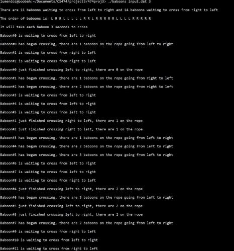
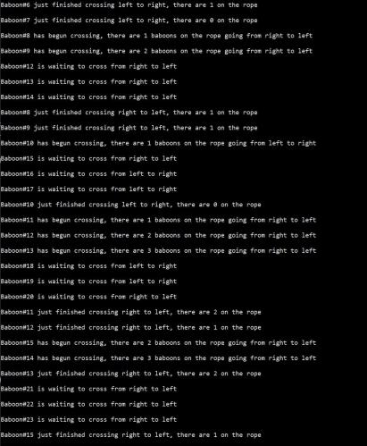
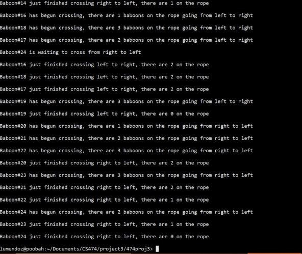

# Baboon Project Report.

## Bradley Ross, Ziad Arafat, Luis Mendoza, Angel Camacho

## Abstract: 
#### With this project we will be taking on problem one, where we will be demonstrating an approach on how to use semaphores to synchronize baboons crossing a canyon with a rope. We will show the methods we used to solve this problem and what how we were able to successfully synchronize the baboons crossing. 

## Introduction: 
#### With this project we will be working on baboon problem where baboons can only cross a canyon by swinging hand-over-hand on the rope. It is important to note the fact that in this problem "baboons" should not enter from oposite directions and meet in the middle other wise they will fall to their death, not to mention no more then three baboons may be on the rope other wise the rope rips and they fall to their death. The order that the baboons started crossing must also be maintained as they finish crossing. 

## Methodology:
#### First we read a file passed as a command line argument which includes the order that the baboons arrive and which direction they are going. This file is read and the directions are stored in an array which will be read in order to create the threads which represent the baboons trying to cross the canyon. To represent each baboon we will be utilizing a thread, the thread will run one of two functions based on which direction they are going. A total of 5 semaphores are used to perform the synchronization tasks. The rope that the baboons are crossing on is represented as one of these semaphores. Representing a baboon travelling either right or left on the rope, the rope semaphore ensure that once a baboons starts going one direction another cannot cross from the other direction until the rope is free. Two semaphores are used to maintain order on the rope, this keeps a baboon from finishing before a baboon that was ahead of it on the rope. Another semaphore which is intialized to three represents the capacity of the rope and prevents more than three baboons from being on the rope. 

## Results: 
|   Results   |
|---|
|   |
|    |
|    |

 Code
```C
#include <fcntl.h>
#include <pthread.h>
#include <semaphore.h>
#include <stdio.h>
#include <stdlib.h>
#include <sys/ipc.h>
#include <sys/shm.h>
#include <sys/types.h>
#include <sys/wait.h>
#include <unistd.h>

////Create semaphores////
sem_t rope; // The rope sempahore blocks baboons from entering the rope from both sides
sem_t right_to_left_mutex; // The right_to_left_mutex ensures that the queue
        // stays in order while crossing right to left
sem_t left_to_right_mutex; // The left_to_right_mutex ensures that the queue
        // stays in order while crossing left to right
sem_t mutex; // The mutex semaphore prevents one side from holding the rope indefinently
sem_t capacity; // The capacity semaphore prevents more than 3 baboons from being on the rope at once

int left = 0; //The left and right variables are used to check if the rope is free
int right = 0; // to control if the rope semaphore needs to be posted or wait
int cross_time; // Time to wait while baboons cross

//The function to run when a baboon is crossing from the left side to the right side
void *left_to_right(void *baboonnum ) {
        //Wait until mutex and left_to_right_mutex are available
        sem_wait( &mutex );
        sem_wait( &left_to_right_mutex );
        //Increment the value in left
        left++;
        //If the value in left is 1, that means there are no
        // baboons going from left_to_right currently, so the function
        // must check that the rope is not being used by the other side
        if ( left == 1 ) {
                sem_wait( &rope );
        }
        // Create variables to hold the baboon number and
        // how many baboons are currently on the rope
        int *num = (int*) baboonnum;
        int numonrope;
        //Post to the mutex semaphores to allow another thread to start
        // however because the rope semaphore was not posted, the other side
        // cannot start until this side finishes
        sem_post( &left_to_right_mutex );
        sem_post( &mutex );
        //Check that capacity is not empty, which keeps the rope
        // from having more than 3 baboons on at once
        sem_wait( &capacity );
        sem_getvalue( &capacity, &numonrope );
        //The print statement simulates the crossing beginning
        printf( "Baboon#%d has begun crossing, there are %d baboons on the rope going from left to right\n\n",
                *num, 3 - numonrope );
        //Sleep for the given amount time provided by the user
        sleep( cross_time );
        sem_getvalue( &capacity, &numonrope );
        //Print once the baboon has finished crossing
        printf( "Baboon#%d just finished crossing left to right, there are %d on the "
                "rope\n\n",
                *num, 2 - numonrope);
        //Post back to the capacity once a baboon leaves the rope
        sem_post( &capacity );
        //Decrement the value in left
        sem_wait( &left_to_right_mutex );
        left--;
        //If left is 0, it means there are no baboons currently crossing from left_to_right
        // and that the rope can be incremented to allow the other side to start crossing
        if ( left == 0 )
                sem_post( &rope );
        sem_post( &left_to_right_mutex );
        pthread_exit( NULL );
}
//This function is identical to the left_to_right function except
// going the other direction
void *right_to_left( void *baboonnum ) {
        
        sem_wait( &mutex );
        sem_wait( &right_to_left_mutex );
        right++;
        if ( right == 1 ) {
                sem_wait( &rope );
        }
        int *num = (int*) baboonnum;
        int numonrope;
        sem_post( &right_to_left_mutex );
        sem_post( &mutex );
        sem_wait( &capacity );
        sem_getvalue( &capacity, &numonrope );
        printf( "Baboon#%d has begun crossing, there are %d baboons on the rope going from right to left\n\n",
                *num, 3 - numonrope );
        sleep( cross_time );
        sem_getvalue( &capacity, &numonrope );
        printf( "Baboon#%d just finished crossing right to left, there are %d on the "
                "rope\n\n",
                *num, 2 - numonrope);
        sem_post( &capacity );
        sem_wait( &right_to_left_mutex );
        right--;
        if ( right == 0 )
                sem_post( &rope );
        sem_post( &right_to_left_mutex );
        pthread_exit( NULL );
}

int main( int argc, char **argv ) {
        FILE *file; // File to read from
        int *timetocross = ( int * )malloc(
                sizeof( int ) ); // Used to set time taken for baboons to cross
        char baboons[100]; // Used to hold queue of baboons
        int babooncount = 0;
        int lcount = 0; // Used to determine how many baboons are going in each
                // direction in the queue
        int rcount = 0;
        char direction; //Used to hold the value of the character being read from the file
        // Check that arguments are provided
        if ( argc < 3 ) {
                printf( "Please enter a file name followed by an integer 1-10 which "
                        "represents the time taken to cross the rope\n" );
                free( timetocross );
                return -1;
        }
        file = fopen( argv[1], "r" ); // Open file to read order of baboons from
        int gettime = atoi( argv[2] );
        cross_time = gettime;

        // Fill the queue of baboons based on the order provided from the file
        while ( ( fscanf( file, "%c", &direction ) != EOF ) ) {
                if ( direction == ',' )
                        continue;
                if ( direction == 'L' ) {
                        lcount = lcount + 1;
                        baboons[babooncount] = 'L';
                        babooncount = babooncount + 1;
                }
                if ( direction == 'R' ) {
                        rcount = rcount + 1;
                        baboons[babooncount] = 'R';
                        babooncount = babooncount + 1;
                }
        }
        // Print how many baboons are on each side to cross
        printf("\nThere are %d baboons waiting to cross from left to right"
           " and %d baboons waiting to cross from right to left\n\n",lcount, rcount);
        printf("The order of baboons is: ");
        for(int i = 0; i < babooncount; i++){
            printf("%c ", baboons[i]);
        }
        printf("\n\nIt will take each baboon %d seconds to cross\n\n", cross_time);
        // Initialize correct number of threads for each side
        pthread_t l_to_r_thread[lcount];
        int left_thread_count = 0;
        pthread_t r_to_l_thread[rcount];
        int right_thread_count = 0;
        // Initialize semaphores
        sem_init( &rope, 0, 1 );
        sem_init( &right_to_left_mutex, 0, 1 );
        sem_init( &left_to_right_mutex, 0, 1 );
        sem_init( &mutex, 0, 1 );
        sem_init( &capacity, 0, 3 );
        // Create threads based on order of queue
        for ( int i = 0; i < babooncount; i++ ) {
                int *tharg = (int*)malloc(sizeof(*tharg));
                *tharg = i;
                sleep(1);
                if ( baboons[i] == 'L' ) {
                        // printf("Left baboon\n");
                        printf( "Baboon#%d is waiting to cross from left to right\n\n", i );
                        pthread_create( &l_to_r_thread[left_thread_count], NULL,
                                        left_to_right, tharg);
                        left_thread_count++;
                } else if ( baboons[i] == 'R' ) {
                        printf( "Baboon#%d is waiting to cross from right to left\n\n", i );
                        pthread_create( &r_to_l_thread[right_thread_count], NULL,
                                        right_to_left, tharg);
                        right_thread_count++;
                }
        }
        // Wait for threads to finish
        for ( int j = 0; j < left_thread_count; j++ ) {
                pthread_join( l_to_r_thread[j], NULL );
        }
        for ( int j = 0; j < right_thread_count; j++ ) {
                pthread_join( r_to_l_thread[j], NULL );
        }
        free( timetocross );
        // Destroy semaphores
        sem_destroy( &rope );
        sem_destroy( &right_to_left_mutex );
        sem_destroy( &left_to_right_mutex );
        sem_destroy( &mutex );
        sem_destroy( &capacity );
        return 0;
}
```

## Conclusion:
#### This assignment is the perfect analogy of how threads are able to be synchronized with the use of semaphores. By using threads to represent each baboon, we showed how resources can be shared among different threads running in parallel while maintaining order and synchronization.
